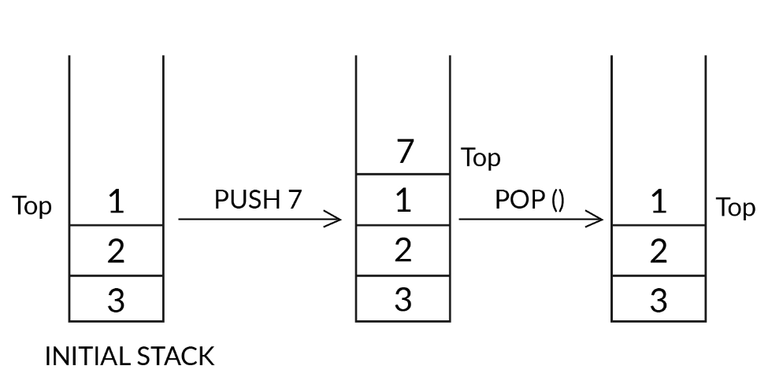
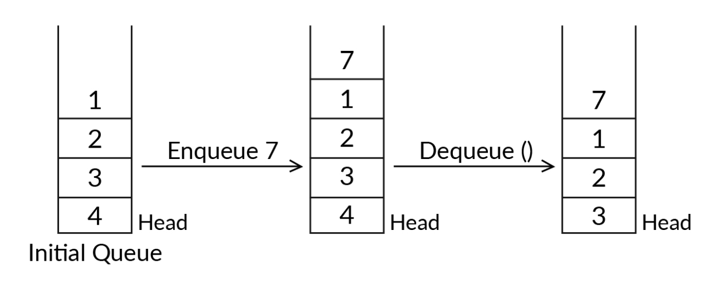
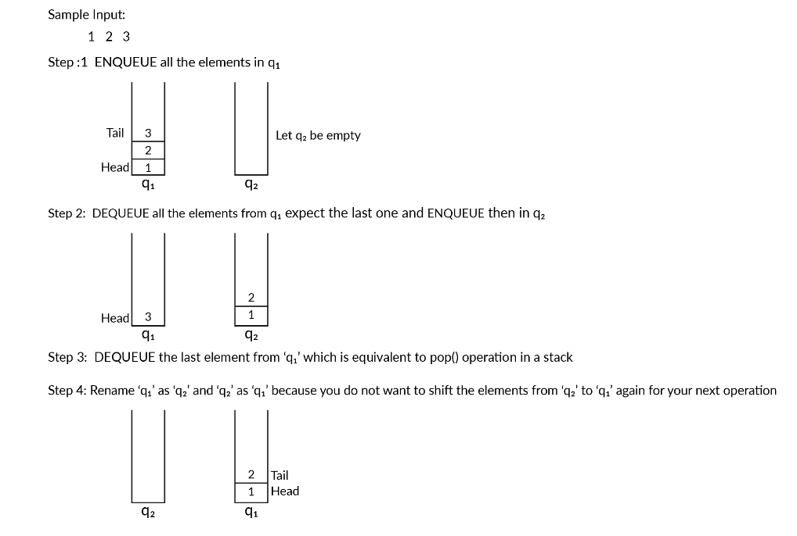

# Stack using Queues

 There are two approaches.

 - While the first approach makes the push operation costly
 - the other makes the pop operation expensive.
 
 The time and space complexities of both the approaches is the same: O(n).

## Explanation

Stack is the data structure that follows the LIFO property. LIFO stands for Last In, First Out, which means the most recently added element would be removed/accessed first. However, Stack has a restriction: Insertion and deletion can be done only at one end, which is called the 'TOP' of the stack.

The image below illustrates the 'push' and 'pop' operations on a stack.



In contrast, Queue is the data structure that follows the FIFO property. FIFO stands for First In, First Out, which implies the element that is inserted first would be removed/accessed first. In queues, you can insert (enqueue) elements only at one end, which is called ‘TAIL’, and deletion (dequeue) of elements in the queue can take place at the other end, which is called ‘HEAD’.  



### Scenario

#### Stack

Consider a stack with the same elements as those in queue ‘q1’, i.e., { 2, 4, 1, 0, 5 }; here, 2 represents the TOP of the stack. Now, 6 is added to the stack. Choose the correct set of output elements starting from the element present at the TOP of the stack.

{ 6, 2, 4, 1, 0, 5 }

A new element is always added at the TOP of the stack. Therefore, the TOP of the stack would be updated to 6, and it will be placed just above the element previously at the TOP, i.e., 2.

#### Two Queues

You are given two queues, ‘q1’ and ‘q2’. While ‘q2’ is empty, ‘q1’ contains the elements { 2, 4, 1, 0, 5 }, where HEAD = 2 and TAIL = 5.  A new element, ‘6’, is added to ‘q2’, and then the elements of ‘q1’ are removed one by one and added to ‘q2’.

What would be the output if all the elements of ‘q2’ are printed in the same sequence as they are in the queue starting from the HEAD?

Initially, ‘q2’ is empty, and so, after adding ‘6’, the HEAD and TAIL of ‘q2’ are ‘6’. Later, all the elements of ‘q1’ are added to ‘q2’. The HEAD of the queue is still ‘6’, but the TAIL is now ‘5’; therefore, the elements in ‘q2’ are {6, 2, 4, 1, 0, 5}.

{ 6, 2, 4, 1, 0, 5 }

#### Conclusion

LIFO function of a stack can be implemented using two queues.

However, to execute a push operation, multiple statements have to be executed on both the queues. Hence, we can say that this method makes the push operation costly.

```java
Queue<Integer> q1 = new LinkedList<>();
Queue<Integer> q2 = new LinkedList<>();

void push (int x ){
  q2.add(x);

  while(!q1.isEmpty()){
    q2.add(q1.peek());
    q1.remove();
  }

  Queue<Integer> tempQ = q1;
  q1 =q2;
  q2 = tempQ;
}

int pop(){
  if(q1.isEmpty()){
    throw StackIsEmpty();
  }

  return q1.remove();
}

```

### Stack with Pop as costly

We will be using two queues, Q1 and Q2, to implement the stack.

Pseudocode:

- push(x)
  - Enqueue x to Q1

- pop()
  - Dequeue each element, except the last one, from Q1 and insert into Q2 one by one

  - Dequeue the last element from Q1 – which is the result – and store it

  - Swap the names of Q1 and Q2

  - Return the element stored in Step 2

This method is based on making the ‘pop’ operation costly.



## pseudocode

```java
Queue<Integer> q1 = new LinkedList<>();
Queue<Integer> q2 = new LinkedList<>();

void push (int x ){
  q1.add(x);
}

int pop(){
  if(q1.isEmpty()){
    throw StackIsEmpty();
  }
  int lastElemnt;
  while(!q1.isEmpty()){
    lastElemnt = q1.peek();    
    q1.remove();
    if(!q1.isEmpty()){
      q2.add(lastElemnt);
    }
  }

  Queue<Integer> tempQ = q1;
  q1 =q2;
  q2 = tempQ;
  return lastElemnt;
}

```

## Time Complexity

o(n) any aproach
