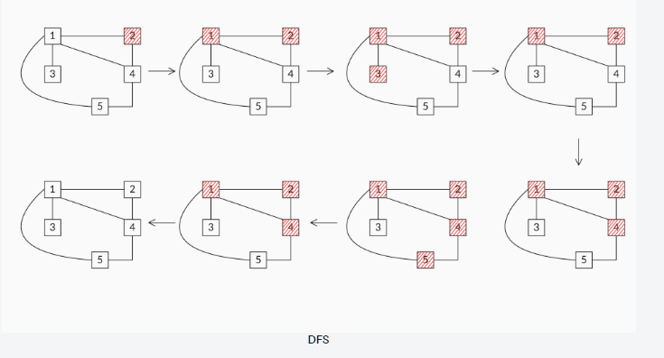
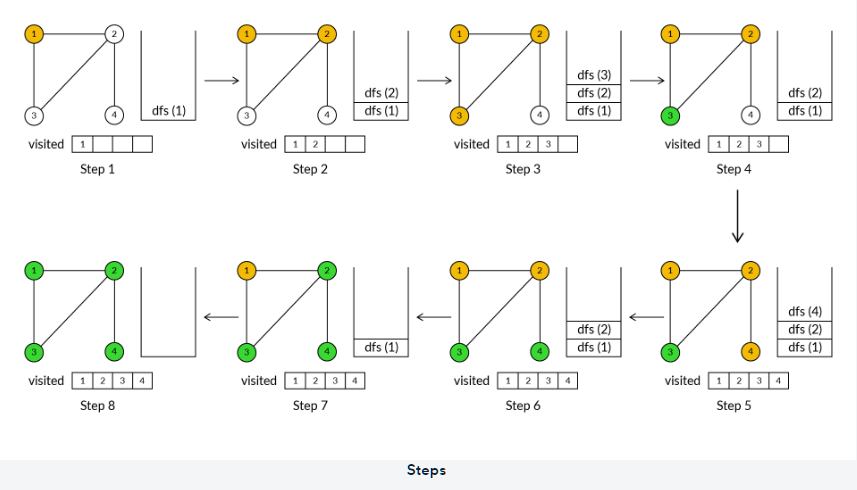

# DFS Tree Traversal

## Explanation

Depth-first search (DFS) is a traversal algorithm. From the start node, it traverses through any one of its neighbours and explores the farthest possible node in each branch before backtracking.

**Backtracking** happens when the search algorithm reaches a node where there are no neighbours to visit, or all the neighbours have been visited already. Then the DFS algorithm traces back to the previous node and traverses any neighbour that is left unvisited. In this way, backtracking helps with traversing through all the connected nodes in the graph and tracing back to the start node.



Now, let’s take a look at the steps in finding the DFS traversal of the graph given in Step 1 in the image below, by taking node 1 as the starting node of the traversal.



The steps in the image above are explained below:

- Step 1: Run the dfs() method on node ‘1’ and add that node to the visited list

- Step 2: The dfs(1) method recursively calls for all the unvisited neighbours of node ‘1’:
    - Here, the unvisited neighbours of node ‘1’ are {2, 3}.
    - Let us assume that dfs(1) recursively calls for node ‘2’ first and adds the node to the visited list.

- Step 3: The dfs(2) method recursively calls for all the unvisited neighbours of node ‘2’:
    - Here, the unvisited neighbours of node ‘2’ are {3, 4}.
    - Let us assume that dfs(2) recursively calls for node ‘3’ first and adds the node to the visited list.

- Step 4: The dfs(3) method recursively calls for all the unvisited neighbours of node ‘3’. Since there are no remaining unvisited neighbours of node ‘3’, it returns back.

- Step 5: The dfs(2) method recursively calls for all the unvisited neighbours of node ‘2’:
    - Here, the unvisited neighbour of node ‘2’ is {4}. So, dfs(2) recursively calls for node ‘4’ and adds the node to the visited list.

- Step 6: The dfs(4) method recursively calls for all the remaining unvisited neighbours of node ‘4’. Since there are no remaining unvisited neighbours of the node ‘4’, it returns back.

- Step 7: The dfs(2) method recursively calls for all the remaining unvisited neighbours of node ‘2’. Since there are no remaining unvisited neighbours of the node ‘2’, it returns back.

- Step 8: The dfs(1) method recursively calls for all the remaining unvisited neighbours of node ‘1’. Since there are no remaining unvisited neighbours of the node ‘1’, it returns back.

The visited list is the DFS of the graph.

## Pseudocode

```pseudocode

Visited ← { }

Procedure dfs(n)

  add n to visited set

  for all n` ∈ neighbours(n) do

        if (n` ∉ visited) then

            dfs(n`)

        end if

  end for

end procedure

```