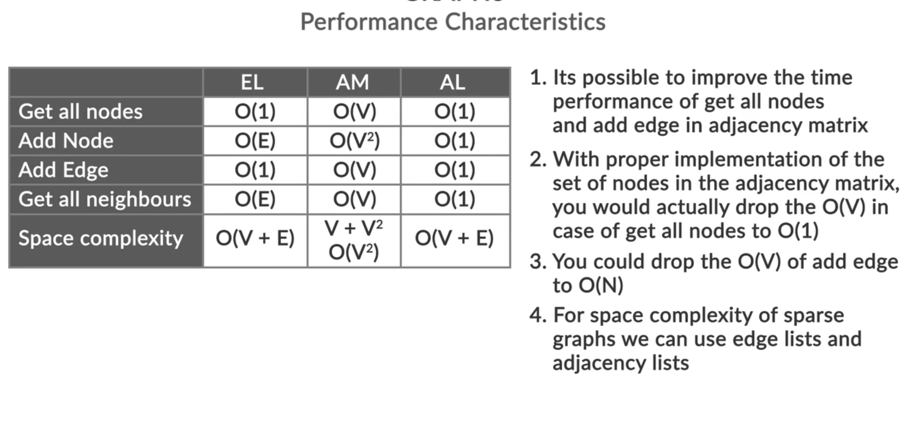

# Implementing a graph

## Explanation

There are three ways that a graph can be implemented

- Edge List
- Adjacency Matrix
- Adjacency List

### Edge List

An edge list represents a graph as a list of its edges.

```graph

  A -- B
  |    |
  C -- D

Edge List: [(A-B), (A-C), (B-D), (C-D)]

```

An edge list fails in a scenario wherein you have an isolated node in your graph. To overcome this problem, you will be introduced to a second graph implementation, an ‘adjacency matrix’.

- Suitable for sparse graphs where E is much less than V^2.
- Useful when the graph is being modified frequently (adding/removing edges).
- Good for scenarios where you need to enumerate all edges efficiently.

### Adjacency Matrix

An adjacency matrix is a 2D array (or matrix) where the element at row i and column j indicates the presence (and possibly weight) of an edge between vertices i and j.

```graph

  A -- B
  |  /
  C -- D

Adjacency Matrix:
  A B C D
A 0 1 1 0
B 1 0 1 0
C 1 1 0 1
D 0 0 1 0

```

Note: Adjacency matrix is symmetric only in the case of an undirected graph, whereas in the case of a directed graph, it is non-symmetric.

- Suitable for dense graphs where E is close to V^2.
- Useful when you need to frequently check the existence of an edge between any two vertices.
- Ideal for algorithms that benefit from quick edge look-up, like the Floyd-Warshall algorithm.

### Adjacency List

An adjacency list represents a graph as a list of lists. Each list at index i contains the neighbors of vertex i.

```graph

  A -- B
  |  /
  C -- D

Adjacency List:
A: [B, C]
B: [A, C]
C: [A, B, D]
D: [C]

```

- Suitable for most real-world sparse graphs where E is much less than V^2.
- Efficient for traversal algorithms like DFS and BFS.
- Ideal when you need to enumerate all neighbors of a vertex efficiently.
- Better space efficiency compared to an adjacency matrix for sparse graphs.

## Notes

> Adjacency list can be concluded to have the most optimal behaviour, but, again, this depends upon your requirements.

## Analysis



## Problem Statement


### Description


### The code should


### Solution

```java


```

```graph
  
  
```
