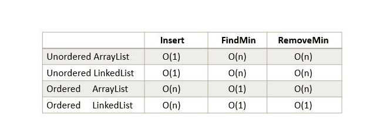
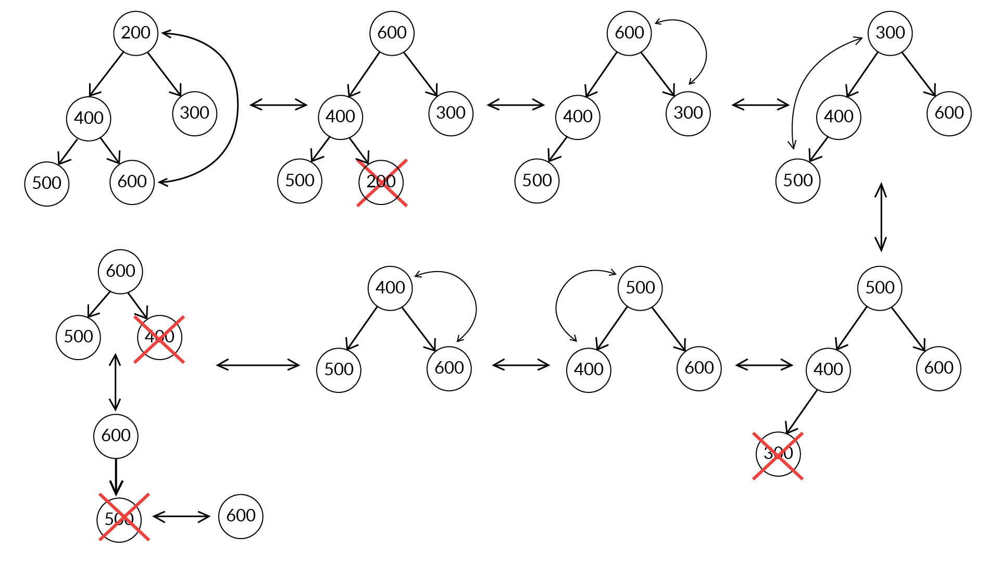
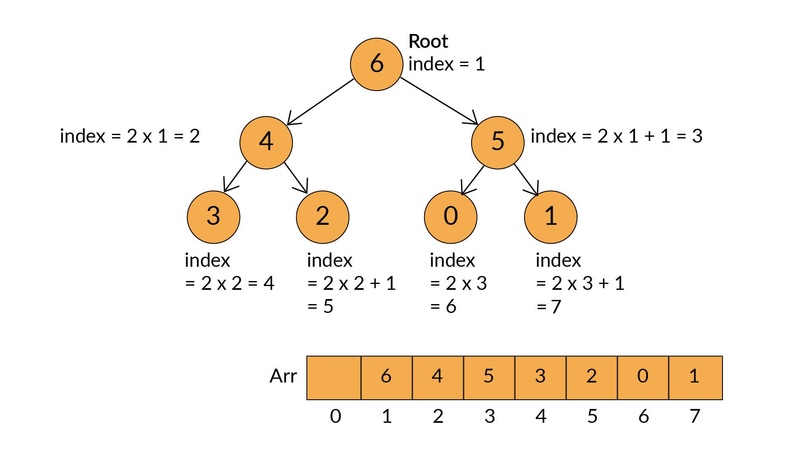

# PriorityQueue

## Explanation

A priority queue is a special type of queue in which each element is associated with a priority value. And, elements are served on the basis of their priority. In a queue, the first-in-first-out rule is implemented whereas, in a priority queue, the values are removed on the basis of priority. That is, higher priority elements are served first.

However, if elements with the same priority occur, they are served according to their order in the queue.

The two types of priority queues are as follows:

- max priority queues : In a max priority queue, the largest element (the element containing the most value) is given the highest priority
- min priority queues. in a min priority queue, the smallest element (the element containing the least value) is given the highest priority.

ADT functions

- removeMinimum()
- minimum()
- add(T element)
- isEmpty()
- size()

> Priority queues can be implemented using common data structures such as arrays, linked lists, heaps and binary trees.

## Notes

Some of the applications of a priority queue are:

- Dijkstra's algorithm
- for implementing stack
- for load balancing and interrupt handling in an operating system
- for data compression in Huffman code

## Analysis

For priority que using a list 

### Heap Implementation

The binary heap data structure could implement the basic operations of a priority queue in O(log n) time, which is a performance improvement over the list implementation of the priority queue.

Heaps have following properties:

- They are complete binary trees.
- Order property: They maintain a hierarchical (level-wise) order among the nodes of their trees (i.e., min heap or max heap).
- root node of a tree always contains the minimum element, and any addition or deletion in a heap might disturb the heap’s properties
- the last node is the most important one because all new node insertions and deletions are done at the last node of a heap
- The two heapify operations are as follows:
    - HeapifyUp is used during insertions.
    - HeapifyDown is used during deletions.

> You can visit this [link](https://visualgo.net/en/heap) for the visualisation of basic operations on a binary max-heap with their pseudocode.
> You can refer to this [link](http://www.sanfoundry.com/java-program-implement-binary-heap/) to learn about the implementation of a binary heap.

#### removing element from heap

- The minimum value, which is at the root node, cannot be removed directly. 
- First, it is swapped with the last node, and then, it is deleted from the last node because, 
- all insertions and deletions are done at the last node only.

### Implementing a Binary tree using array

- The root node is the initial element of the array and any child node’s index is 2*i or 2*i+1 if the parent’s index is i.

### Heap Sort

Implementing a priority queue using a heap, it sorts the elements inside the heap in O(nlog n) time. This method of sorting is known as heap sort.

> Heap sort is an in-place algorithm, which means that you do not need any extra space from the memory to perform the sort.
>You can refer to this [link](https://www.geeksforgeeks.org/heap-sort/) to read about the direct implementation of heapsort.
